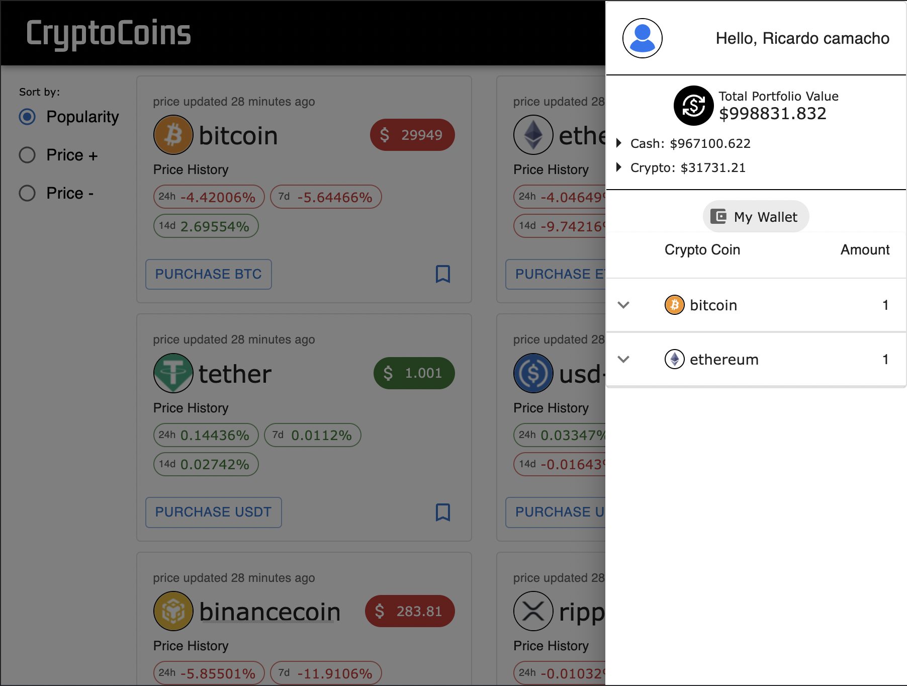

# Crypto Exchange

Lorem ipsum dolor sit amet, consectetur adipiscing elit, sed do eiusmod tempor incididunt ut labore et dolore.



<div align="center">

[Visit Crypto Exchange](https://rcamach7.github.io/crypto-exchange/#/)

</div>

## Key Features

- Lorem ipsum dolor sit amet, consectetur adipiscing elit, sed do eiusmod tempor incididunt ut labore et dolore
- Lorem ipsum dolor sit amet, consectetur adipiscing elit, sed do eiusmod tempor incididunt ut labore et dolore
- Lorem ipsum dolor sit amet, consectetur adipiscing elit, sed do eiusmod tempor incididunt ut labore et dolore

#### Built Using:

- react, create-react-app, axios, uuid, react-router-dom, sass, font awesome icon's, socket-io-client, useEffect, useState, useContext, React.Context, axios interceptors, custom hooks, hash router, promise based functions, async/await, custom API, moment etc...

#### How to install and run?

```bash
 git clone https://github.com/rcamach7/crypto-exchange
 cd crypto-exchange

#  Run local server
 cd api
 npm install
 npm run serverstart

#  Run client
cd ../client
npm install
npm start
```

API server would need the following environment variables provided to run successfully:

- MONGO_DB, SECRET_STRING, PORT

#### To-Do's

- Add filter section in homepage, where users can only view crypto cards that they're currently invested into.
  - Add a greyed out filtered option of "bookmarked", so in the future we can implement bookmarking crypto cards.
  - have these filters work together with our sorting to provide these two effects together.
- Add ability for user to update:
  - profile picture
  - full name
- Upgrade formatPrice helper function, to take an extra argument, where we can specify up to how many decimal points to format a number to. This will help use it to better serve use-cases across our application.
- Create simple welcome page - just breaking down our application. How the site works:
  - when buying we always use the most current price
  - cryptos get auto updated when 30 minutes elapsed since they were individually last updated, or if users have recently purchased or sold a specific crypto - that gets updated individually.
